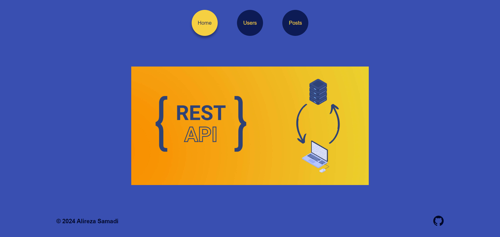

# Rest Api



### Url
https://restapivue2024.netlify.app/

### About
A small project with Vue and using axios to get data This project.

## Project setup
```
npm install
```

### Compiles and hot-reloads for development
```
npm run serve
```